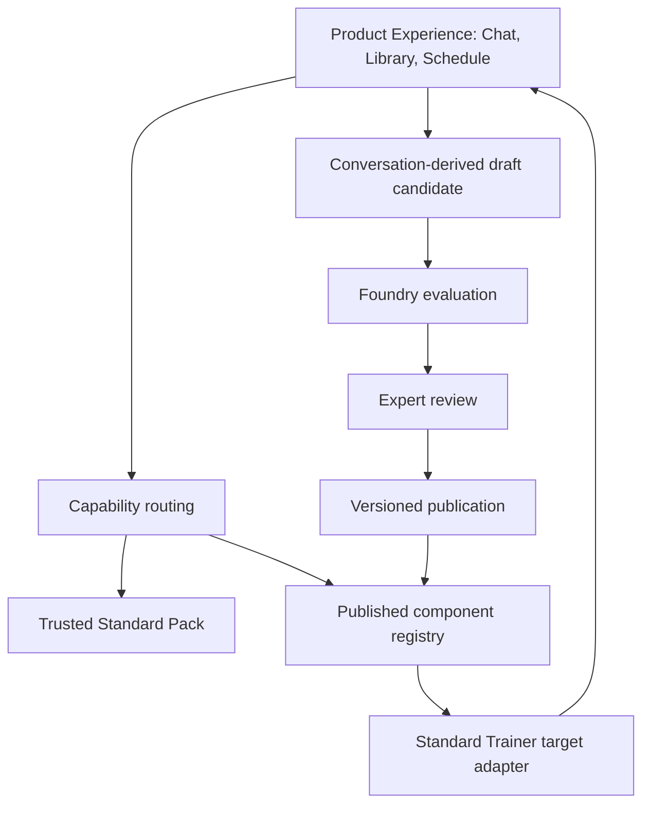

# Architecture

## Product relationship

The Product Experience captures a learner need, routes it through trusted standards and a published component, preserves bounded evidence, and schedules follow-up. The Governance Workbench turns reusable evidence patterns into reviewed, versioned components. Standard Trainer executes those published contracts.

The system has two distinct evaluators:

1. Foundry evaluation decides whether a component is structurally, numerically, pedagogically, and operationally fit to publish.
2. Trainer diagnosis decides whether learner evidence satisfies an already published reasoning contract.

## Repository modules

- `src/contracts`: canonical TypeScript types, expression AST, Zod schemas, and schema version.
- `src/standards`: CAIE 9701 operational constraints for Stoichiometry and Equilibria.
- `src/components`: migrated, expert-authored, and published snapshots.
- `src/generation`: deterministic mock generation only.
- `src/governance`: evaluation, lifecycle, semantic versioning, immutability, and hashes.
- `src/runtime`: downstream capability profile and preview adapter.
- `src/experience`: conversation, evidence, schedule, candidate domain flow, local repository, and experience UI.
- `scripts`: export, sibling-sync, and fixed-port local demo commands.
- `dist-contract`: generated consumer artifacts.

## Static boundary

Both query-routed views are fully deployable as static Vite output. Browser `localStorage` preserves one demo session only. There is no server, account system, database, model provider, cross-user analytics, or durable multi-user workflow. The online build remains a portfolio convenience; localhost is the authoritative demo because it can run Foundry and the sibling Trainer together.

Conversation-derived provenance does not extend the published schema. It is Foundry draft metadata containing candidate, conversation, and evidence IDs. Publication still uses the existing expert-authored origin and executable contract boundary.
