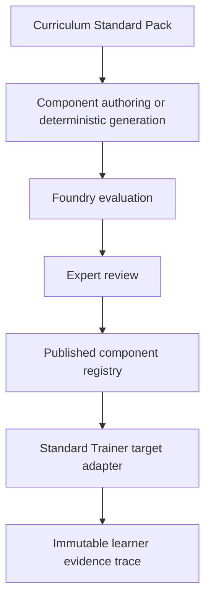

# Architecture

## Authority and flow

Learning Foundry owns the canonical component contract, standard packs, authoring provenance, content evaluation, review gate, versioning, publication hash, and exported registry. Standard Trainer owns learner-attempt diagnosis and evidence traces. Shared payloads do not move Trainer domain logic into Foundry.

The system has two distinct evaluators:

1. Foundry evaluation decides whether a component is structurally, numerically, pedagogically, and operationally fit to publish.
2. Trainer diagnosis decides whether learner evidence satisfies an already published reasoning contract.

## Repository modules

- `src/contracts`: canonical TypeScript types, expression AST, Zod schemas, and schema version.
- `src/standards`: CAIE 9701 operational constraints for Stoichiometry and Equilibria.
- `src/components`: migrated, expert-authored, and published snapshots.
- `src/generation`: deterministic mock generation only.
- `src/governance`: evaluation, lifecycle, semantic versioning, immutability, and hashes.
- `src/runtime`: downstream capability profile and preview adapter.
- `scripts`: export and sibling-sync commands.
- `dist-contract`: generated consumer artifacts.

## Static boundary

The workbench is fully deployable as static Vite output. There is no server, account system, database, model provider, or durable multi-user workflow. UI edits are local session state. The demo registry is rebuilt from reviewed source definitions using fixed publication metadata.

